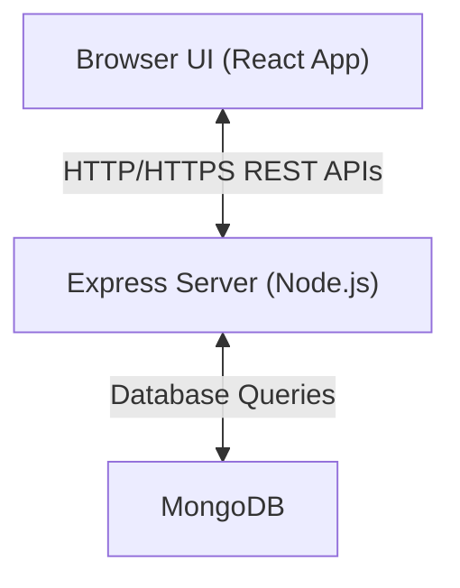

# Management-Portal

This is a full-stack web application class project that is meant to give students practice in Enterprise-level software deployment. 

As a part of the SWEN **Enterprise Software Engineering** class, teams were required to create a fully functioning web-app to better manage the internal departments of a company.
My team was assigned to a Pharmaceutical company, and I was responsible for building out the functionalities of the HR department.

## Team Members
- Alex Hetrick (Manufacturing)
- Jackson Shortell (Sales)
- Howard Kong (Payroll)
- Owen Lowry (IT)
- Mingfeng Zhong  (HR)

## Software Architecture

My application consists of 3 main components:
- **React** (Front-end)
- **Node.js Server** (Back-end)
- **MongoDB** (Data storage)

When a change is made on the web pages, a request is sent through the REST API to the server. The server then stores the update in the database. Then the server will pull the changes, 
pass it through the REST API, and in turn, update the web pages to reflect the new change.

The following is a flow diagram representing the process in detail:



## Deployment

For our team, we broke down the deployment process into 3 phases: 
1. **Planning**
2. **Execution**
3. **Integration**

Rather than jumping into action immediately, we spent a week putting together a deployment plan. Due to code implementation and API endpoints being drastically
different across departments, we needed to determine how to efficiently deploy our web applications, but with as few code changes as possible.

Our solution was this: 
- Have a universal server.js file that imports routes from each project
- Refactor API endpoints to follow the format of *[department_name]/api*

Once the endpoints are secured and the server routes can be connected with no problem, the corresponding React pages will also be able to load with no issues.

Centering around this idea, our deployment plan became clear:
1. Update API endpoints
2. Each person will build their project into a dist folder, and then upload that folder to the deployment repo
3. Utilize shell scripts to unzip and sort the projects in order

Here is the overall file structure that we came up with:
```
deployment_repo/
├── master_server/
│   ├── node_modules/
│   ├── server.js            # Integrated routes for all departments
│   ├── .env
│   ├── package.json
│   └── package-lock.json
│
├── builds/
│   ├── manufacturing_client.zip
│   ├── manufacturing_server.zip
│   ├── sales_client.zip
│   └── sales_server.zip
│
├── build.sh                 # Unzips builds and creates directory structure
├── deploy.sh                # Moves files to target server
└── ...
```

# Special Thanks

Once again, thank you to my team. I would not have been able to learn so much and gotten so much done without you guys.
